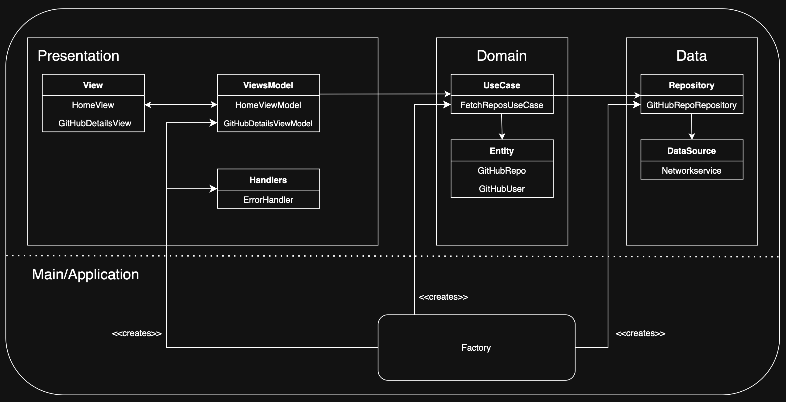

# Github Challenge

## Overview

The goal of this project is to develop a native mobile application that allows users to search for a GitHub profile by entering a username. The application will display the user's name, profile photo (if available), and a list of repositories with their titles and programming languages. 

The app uses the GitHub API and implements an architecture based on Clean Architecture + MVVM.

## Features

- **Home Screen**: Includes a text field for entering the GitHub username and a search button that redirects to the profile detail screen.
- **Profile Detail Screen**: Displays the user's name, photo (if available), and a list of repositories with their titles and programming languages.
- **Back Button**: Allows users to return to the home screen to perform a new search.
- **Error Handler**: Handles and displays API errors directly on the screen. Example cases include:
  - **Network Error**: "A network error has occurred. Check your Internet connection and try again later."
  - **User Not Found**: "User not found. Please enter another name."

## Architecture Overview

The app follows a Clean Architecture+MVVM (Model-View-ViewModel with additional layers to ensure proper separation of concerns.

## Presentation Layer
Responsible for everything the user interacts with:
- **Views**: Built using SwiftUI, these are declarative and update when their state changes. They display data and handle user interactions.
- **ViewModels**: Act as intermediaries between the View and Domain Layer. They fetch data from UseCases, process it, and expose it in a consumable format for the View.

## Domain Layer
Contains the core business logic, independent of UI or data frameworks:
- **UseCases**: Encapsulate the business rules and coordinate data flow between the repository and ViewModel.
- **Entities**: Represent the core business model, defined as pure Swift structures or classes.

## Data Layer
Handles data management and retrieval:
- **Repositories**: Provide a clean interface for the Domain Layer to interact with data sources, abstracting the complexities of data fetching and caching.
- **DataSources**: Fetch data from remote or local sources (e.g., APIs or databases), serving as the building blocks for the repositories.

## Main/Application Layer
Uses a **Factory** to compose and create essential objects, like the ViewModel, ensuring proper initialization with the required dependencies.

#### Representation diagram:

## Motivation
Clean Architecture with MVVM gives a huge control over our application, you have the power of testability, scalability, separation of concerns, maintainability, reusability, and data binding.

## License 

### MIT
